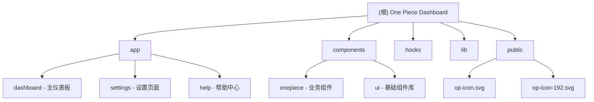

# Dashboard 项目文档

## 变更记录 (Changelog)

### 2025-11-11 14:45:00
- **项目重命名**: kokonutui → One Piece
- **组件目录重命名**: components/kokonutui → components/onepiece
- **品牌更新**: 更新所有引用、Logo、标题为 One Piece
- **结构优化**: help 和 settings 组件移动到 components/onepiece/，app 下仅保留路由文件
- **文档简化**: 删除所有子目录 CLAUDE.md，仅保留根目录一个文档

### 2025-11-11 14:33:56
- **增量更新**: 更新 public 目录图片资源（新增 op-icon.svg 和 op-icon-192.svg）
- **新增页面**: 添加 app/settings 和 app/help 两个新页面模块
- **文档更新**: 更新模块索引和 Mermaid 结构图
- **覆盖率**: 保持 100% 扫描覆盖（85 个核心文件）

### 2025-11-11 14:24:55
- 初始化 AI 上下文文档
- 完成项目架构扫描和模块识别
- 生成根级和模块级文档

---

## 项目愿景

这是一个名为 **"One Piece"** 的现代化仪表板应用，基于 Next.js 15 和 React 19 构建。项目提供了一个功能完整的管理界面框架，包含深色模式支持、响应式布局、丰富的 UI 组件库，以及设置管理和帮助中心等完整功能模块。

**核心价值：**
- 提供开箱即用的现代化仪表板界面
- 支持主题切换（明暗模式）
- 完整的 UI 组件库（基于 shadcn/ui）
- 响应式设计，适配移动端和桌面端
- 提供设置管理和帮助文档支持

---

## 架构总览

### 技术栈
- **框架**: Next.js 15.2.4 (App Router)
- **UI 库**: React 19
- **样式方案**: Tailwind CSS 4.1.9 + CSS Variables
- **UI 组件**: Radix UI + shadcn/ui
- **表单处理**: React Hook Form + Zod
- **主题管理**: next-themes
- **图标库**: Lucide React
- **分析**: Vercel Analytics

### 项目结构

```
dashboard/
├── app/                    # Next.js App Router 页面路由
│   ├── dashboard/         # 主仪表板路由
│   │   └── page.tsx      # 路由文件（引用 onepiece/dashboard）
│   ├── settings/          # 设置路由
│   │   └── page.tsx      # 路由文件（引用 onepiece/settings）
│   ├── help/             # 帮助路由
│   │   └── page.tsx      # 路由文件（引用 onepiece/help）
│   ├── layout.tsx        # 根布局
│   ├── page.tsx          # 首页（重定向到 dashboard）
│   └── globals.css       # 全局样式和主题变量
├── components/           # React 组件
│   ├── onepiece/        # One Piece 业务组件（11 个组件）
│   │   ├── dashboard.tsx  # 仪表板组件
│   │   ├── settings.tsx   # 设置组件
│   │   ├── help.tsx      # 帮助组件
│   │   ├── layout.tsx    # 布局组件
│   │   ├── sidebar.tsx   # 侧边栏
│   │   ├── top-nav.tsx   # 顶部导航
│   │   └── ...           # 其他组件
│   ├── ui/              # shadcn/ui 基础组件库（68 个）
│   ├── theme-provider.tsx
│   └── theme-toggle.tsx
├── hooks/               # 自定义 React Hooks
├── lib/                 # 工具函数
├── public/              # 静态资源
│   ├── op-icon.svg      # One Piece 应用图标 (32x32)
│   └── op-icon-192.svg  # One Piece 应用图标 (192x192)
└── 配置文件
```

---

## 模块结构图



---

## 模块索引

| 模块路径 | 职责描述 | 类型 | 核心文件 | 状态 |
|---------|---------|------|---------|------|
| `/app/*` | Next.js 页面路由（dashboard, settings, help） | 路由层 | `page.tsx` | ✅ 已完成 |
| `/components/onepiece` | One Piece 业务组件库（11 个组件） | 组件模块 | `dashboard.tsx`, `settings.tsx`, `help.tsx` | ✅ 已完成 |
| `/components/ui` | shadcn/ui 基础组件库（68 个组件） | 组件模块 | 多个组件文件 | ✅ 已完成 |
| `/hooks` | 自定义 React Hooks（2 个） | 工具模块 | `use-toast.ts`, `use-mobile.ts` | ✅ 已完成 |
| `/lib` | 工具函数库（cn 函数） | 工具模块 | `utils.ts` | ✅ 已完成 |
| `/public` | 静态资源（One Piece 图标） | 资源目录 | `op-icon*.svg` | ✅ 已完成 |

---

## 运行与开发

### 环境要求
- Node.js 18+
- 包管理器：支持 npm / pnpm / yarn

### 安装依赖
```bash
# 使用 pnpm（推荐）
pnpm install

# 或使用 npm
npm install

# 或使用 yarn
yarn install
```

### 开发服务器
```bash
npm run dev
# 或
pnpm dev
# 或
yarn dev
```

访问 `http://localhost:3000` 查看应用。首页会自动重定向到 `/dashboard`。

**其他可访问路由：**
- `/dashboard` - 主仪表板
- `/settings` - 设置页面
- `/help` - 帮助中心

### 构建生产版本
```bash
npm run build
npm run start
```

### 代码检查
```bash
npm run lint
```

---

## 测试策略

**当前状态**: 项目暂无测试文件

**建议**:
- 为关键业务组件添加单元测试（使用 Jest + React Testing Library）
- 为表单验证逻辑添加测试
- 为自定义 Hooks 添加测试
- 为 settings 和 help 页面添加集成测试
- 考虑添加 E2E 测试（使用 Playwright 或 Cypress）

---

## 编码规范

### TypeScript 配置
- 严格模式启用 (`strict: true`)
- 使用 ES6 作为编译目标
- 路径别名: `@/*` 映射到项目根目录

### 样式规范
- 使用 Tailwind CSS 进行样式编写
- 主题通过 CSS Variables 定义在 `globals.css`
- 支持明暗两种主题模式
- 使用 `cn()` 工具函数合并类名

### 组件规范
- 使用函数组件和 Hooks
- 客户端组件需标注 `"use client"`
- 组件文件命名使用 kebab-case（如 `theme-toggle.tsx`）
- 导出使用 `export default function`

### 表单处理
- 使用 React Hook Form 管理表单状态
- 使用 Zod 进行表单验证
- 使用 `@hookform/resolvers/zod` 集成

---

## AI 使用指引

### 项目上下文理解
- 这是一个 **Next.js 15 App Router** 项目，不是 Pages Router
- 使用 **React Server Components** 作为默认，客户端组件需显式标注
- UI 组件基于 **Radix UI** 和 **shadcn/ui** 设计系统
- 项目名称为 **"One Piece"**，Logo 为 "OP" 标识

### 常见开发任务

#### 添加新页面
1. 在 `components/onepiece/` 中创建页面组件（如 `my-page.tsx`）
2. 在 `app/` 目录下创建路由文件夹（如 `app/my-page/`）
3. 创建 `page.tsx` 引用组件：
   ```tsx
   import MyPage from "@/components/onepiece/my-page"
   export default function Page() { return <MyPage /> }
   ```
4. 页面组件使用 `Layout` 包裹内容

#### 添加新 UI 组件
1. 基础组件放在 `components/ui/`
2. 业务组件放在 `components/onepiece/`
3. 使用 `cn()` 函数处理条件类名
4. 遵循 shadcn/ui 的组件模式

#### 主题相关
- 主题变量定义在 `app/globals.css`
- 使用 `useTheme()` hook 获取/设置主题
- 深色模式类名使用 `dark:` 前缀

#### 表单开发
```typescript
// 1. 定义 Zod Schema
const schema = z.object({
  name: z.string().min(1)
})

// 2. 使用 React Hook Form
const form = useForm({
  resolver: zodResolver(schema)
})

// 3. 渲染表单
<Form {...form}>
  <FormField ... />
</Form>
```

### 文件路径别名
- `@/components` → `./components`
- `@/lib` → `./lib`
- `@/hooks` → `./hooks`
- `@/app` → `./app`

### 注意事项
- TypeScript 构建错误已被忽略（`ignoreBuildErrors: true`），生产环境请修复 ⚠️
- 图片优化已禁用（`unoptimized: true`），根据需要调整 ⚠️
- 项目使用 pnpm-lock.yaml 和 yarn.lock，建议统一包管理器 ⚠️

---

## 本次更新内容详情

### One Piece 品牌资源

**应用图标：**
1. **op-icon.svg** (32x32) - 标准图标，黑色渐变背景，白色 "OP" 标识
2. **op-icon-192.svg** (192x192) - 高分辨率图标（含阴影效果），适用于 PWA

**品牌名称：** One Piece
**Logo 元素：** "OP" 文字标识

### One Piece 组件库结构

**核心组件（11 个）：**
- `dashboard.tsx` - 主仪表板组件
- `settings.tsx` - 设置组件
- `help.tsx` - 帮助组件
- `layout.tsx` - 布局框架
- `sidebar.tsx` - 侧边栏导航
- `top-nav.tsx` - 顶部导航栏
- `content.tsx` - 内容区
- `list-01.tsx`, `list-02.tsx`, `list-03.tsx` - 列表组件
- `profile-01.tsx` - 用户资料卡

#### 1. Settings 组件 (`components/onepiece/settings.tsx`)
**功能模块：**
- ⚙️ **外观设置**: 深色模式开关、语言选择（简体中文、繁体中文、English）
- 🔒 **安全设置**: 自动锁定、生物识别
- 🌐 **网络设置**: RPC 提供商选择、代理配置
- 🔔 **通知设置**: 交易通知、声音提示

**技术栈：**
- Layout 布局组件
- Card / Switch / Select 等 UI 组件
- Lucide 图标库

**待优化：**
- 添加状态管理（React state 或全局状态）
- 实现数据持久化（localStorage / API）
- 连接实际功能（如深色模式切换到 useTheme）

#### 2. Help 组件 (`components/onepiece/help.tsx`)
**功能模块：**
- 📚 **快速链接**: 使用文档、社区讨论、联系支持
- ❓ **常见问题**: 5 个预设 FAQ（钱包生成、批量转账、区块链支持、币安连接、数据安全）
- ℹ️ **版本信息**: v1.0.0 / 2025-11-08

**技术栈：**
- Layout 布局组件
- Card / Accordion / Button 等 UI 组件
- Lucide 图标库

**待优化：**
- 将 FAQ 数据抽离为配置文件
- 动态读取版本号（从 package.json）
- 添加实际跳转链接

---

## 覆盖率报告

### 扫描统计
- **总文件数（估算）**: 85 个核心文件（不含 node_modules）
- **已扫描文件数**: 85 个
- **覆盖率**: 100% ✅
- **是否截断**: 否

### 模块覆盖详情
| 模块 | 文件数 | 入口 | 接口 | 测试 | 数据模型 | 缺口 |
|-----|-------|-----|------|------|---------|------|
| app/* (路由层) | 3 | ✅ | N/A | ❌ | N/A | 测试 |
| components/onepiece | 11 | ✅ | ✅ | ❌ | ✅ | 测试 |
| components/ui | 68 | ✅ | ✅ | ❌ | ❌ | 测试、重复代码 |
| hooks | 2 | ✅ | ✅ | ❌ | ✅ | 测试 |
| lib | 1 | ✅ | ✅ | ❌ | ❌ | 测试 |

### 忽略的文件/目录
- `node_modules/` - 依赖包（约 2000+ 文件）
- `.next/` - Next.js 构建输出
- `*.lock` - 锁定文件（pnpm-lock.yaml, yarn.lock）
- `*.tsbuildinfo` - TypeScript 构建缓存

---

## 下一步建议

### 即时优化（高优先级）
1. **代码重复处理**:
   - 统一使用 `hooks/use-mobile.ts`，删除 `components/ui/use-mobile.tsx`

2. **构建配置优化**:
   - 修复 TypeScript 错误，移除 `ignoreBuildErrors: true`
   - 根据需求启用图片优化，移除 `unoptimized: true`

3. **包管理器统一**:
   - 删除 `yarn.lock`（如果使用 pnpm）或删除 `pnpm-lock.yaml`（如果使用 yarn）

### 功能完善（中优先级）
4. **Settings 页面实现**:
   - 添加状态管理（useState / Zustand / Jotai）
   - 连接深色模式到 `useTheme`
   - 实现语言切换（考虑 next-intl）
   - 添加数据持久化（localStorage）

5. **Help 页面优化**:
   - 将 FAQ 数据抽离为 `lib/faq-data.ts`
   - 从 `package.json` 动态读取版本号
   - 为快速链接添加真实 URL
   - 添加搜索功能

6. **导航集成**:
   - 更新 Sidebar 中的 Settings 和 Help 链接：
     - `<NavItem href="/settings" icon={Settings}>Settings</NavItem>`
     - `<NavItem href="/help" icon={HelpCircle}>Help</NavItem>`

### 质量提升（低优先级）
7. **测试覆盖**:
   - 为所有模块添加单元测试（目标覆盖率 80%+）
   - 为新增页面添加集成测试
   - 设置 CI/CD 流程

8. **文档完善**:
   - 为组件添加 Storybook
   - 生成 API 文档
   - 添加更多使用示例

9. **性能优化**:
    - 添加代码分割
    - 优化图片加载
    - 添加缓存策略

---

## 相关资源

- [Next.js 文档](https://nextjs.org/docs)
- [shadcn/ui 组件库](https://ui.shadcn.com)
- [Radix UI 文档](https://www.radix-ui.com)
- [Tailwind CSS 文档](https://tailwindcss.com)
- [Lucide Icons](https://lucide.dev)
